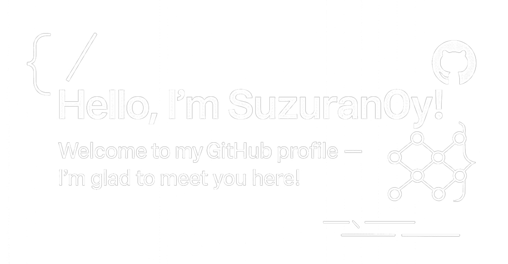
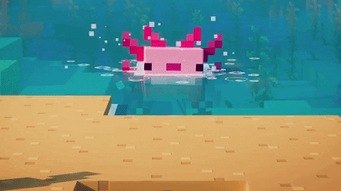

  &nbsp;
  

## About Me

 

- Currently studying in the Department of Mathematics at University College London
- Exploring topics in machine learning and quantitative economics
- Deeply interested in large language models 
and image recognition
- Always open to discuss ideas — feel free to reach out!

## Tech Stack

  
  

  
  

  
  

  
  

  
  

  
  

  
  

  
  

 
 
 

## My Recent Works

<table>
  <tr>
    <td>
      
    </td>
    <td>
      
    </td>
  </tr>
</table>

 
<!-- add record 2026-3-15, 16:46 ->

## Contact Me

 —— yanyu.yan.24@ucl.ac.uk
